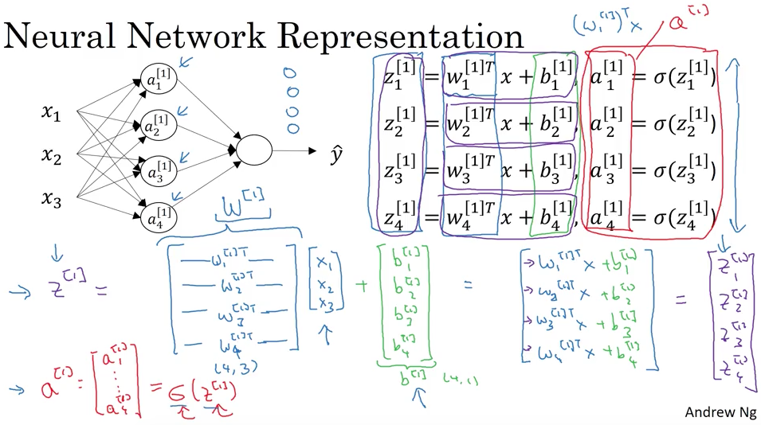

# Week 3 

- a[0] represents feature inputs
- a[1] represents the array of outputs from hidden layer 1
  - a[0]1 represents output of first node
- w[1]: weights for first hidden layer, shape is (num nodes x num inputs)
- b[1]: constants for first hidden layer, shape is (num nodes x 1)

## Computing a neural network's output

- 
